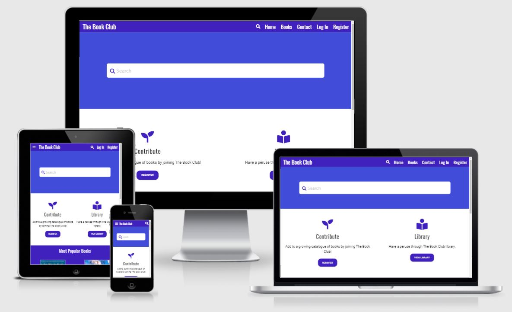
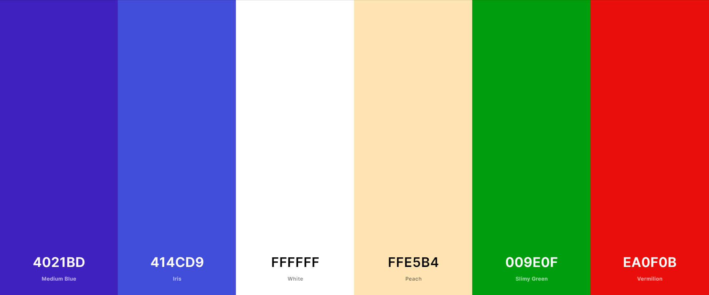
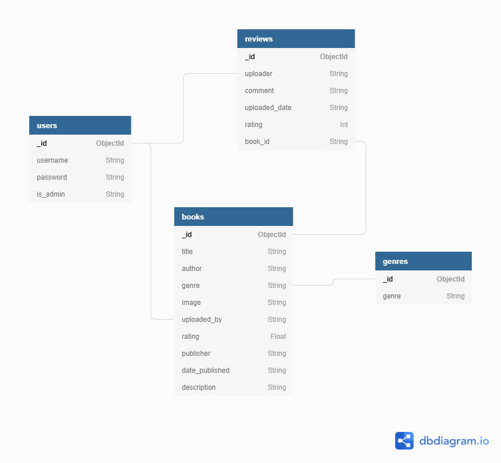

# The Book Club



The purpose of this project is to build a book review and recommendation site.

## Table of Contents
- [User Experience](#user-experience)
    - [Strategy](#strategy)
        - [User Stories](#user-stories)
        - [Project Goal](#project-goal)
        - [Strategy Tradeoffs](#strategy-tradeoffs)
    - [Scope](#scope)
    - [Structure](#structure)
    - [Skeleton](#skeleton)
    - [Surface](#surface)
        - [Typography](#typography)
        - [Colour Scheme](#colour-scheme)
        - [Media](#media)
        - [Effects](#effects)
- [Database Schema](#database-schema)
- [Technologies](#technologies)
- [Testing](#testing)
- [Deployment](#deployment)
- [Credits](#credits)

---
## User Experience

### Strategy

#### User Stories
As a **first-time visitor**, I want:

1. To see a visually appealing website.
2. The website to be intuitive and simple to use.
3. To be able to browse through the books on the site.
4. To be able to search for books by name.
5. To be able to purchase books from the site.
6. To be able to Register as a User on the site.
7. To be able to get visual feedback when an action is completed.
8. To be able to contact the Site Owner for any queries.


As a **returning signed-up user**, in addition to the above, I want:

1. To be able to login to the site.
2. To be able to add books and their details.
3. To be able to view books that you added.
4. To be able to write reviews about any book.
5. To be able to edit details of books and reviews you added.
6. To be able to delete details of books and reviews you added.


As the **site owner**, I want:

1. To earn money on each book purchased on the site via a link from the site.
2. To have the ability as Administrator to remove any books and reviews added by users of the site.
3. To create a website that looks well on different devices and screen sizes.
4. To provide a visually appealing and intuitive website for users.
5. To provide details for users to contact me if they need help with a query.

#### Project Goal
- Project goal:
    - The goal of this project is to build a Full-Stack website that allows users to manage a common dataset about a particular domain.

- Focus:
    - The main focus of this project is to create a visually appealing and intuitive Full-Stack website that allows users to find, review and upload books that they would like to read.

- Definition:
    - I am creating a Full-Stack web application, using HTML, CSS, JavaScript, Python, Flask & MongoDB.

- Value:
    - The value this project will provide, is that it will showcase to future employers my ability to piece together a Full-Stack website, demonstrating proficiency in using HTML, CSS, JavaScript, Python, Flask and MongoDB.
    - The value for users of the application is that it will allow them to search for books, and indeed it will allow them to contribute to and expand the website by adding books of their own.
    - The value for a possible site owner, is that it will allow them to earn money on each book purchased via a link from the site.

#### Strategy Tradeoffs

Opportunity/Problem | Importance (1-5) | Viability/Feasibility (1-5) | Implemented
:-------- |:--------:|:--------:|:--------:
Search Feature | 5 | 3 | :heavy_check_mark:
Add Book | 5 | 4 | :heavy_check_mark:
Edit Book | 4 | 4 | :heavy_check_mark:
Delete Book | 4 | 4 | :heavy_check_mark:
Add Review | 4 | 4 | :heavy_check_mark:
Edit Review | 3 | 4 | :heavy_check_mark:
Delete Review | 3 | 4 | :heavy_check_mark:
Register | 5 | 4 | :heavy_check_mark:
Log in | 5 | 4 | :heavy_check_mark:
Log out | 4 | 4 | :heavy_check_mark:
Contact | 3 | 5 | :heavy_check_mark:
Purchase | 4 | 5 | :heavy_check_mark:
Site Analytics | 1 | 1 | :x:

### Scope
- Main features (For Minimal Viable Product)
    - Navigation Menu
    - Pagination for Books page
    - Search Functionality
    - Call to action Register area on landing page
    - Register
    - Log in
    - Log out
    - User Profile page 
    - User can Add/Edit/Delete Books
    - User can Add/Edit/Delete Reviews
    - Contact Form
    - Visual feedback for users on their actions
    - Fully responsive website
    - Purchase
    - 404 Error page

- Secondary / Future Features:
    - Administrator can delete Users and their content
    - Site Analytics Page
    - User Favourites Page
    - View most popular books
    - Username/Password retrieval
    - Chatbot Functionality

### Structure
A different website structure appears depending on whether a user is logged in or not.

#### Structure when not logged in
1. Home Page
- Displays a Navigation bar along the top of the screen (Common to all pages). This contains the site Logo as well as the following link elements:
    - Home
    - Books
    - Contact
    - Search Icon
    - Login
    - Register
    
- Contains a Search Area below the navigation bar.
- Contains a Call-To-Action register button below the search area on the left.
- Contains a "View Library" button below the search area on the right.
- Shows the most popular books.
- Shows some quotes about reading.
- Displays a footer on the bottom (which will be common across all pages) that contains copyright information, as well as links to the administrator's social media.
2. Books Page
- This page displays a list of all books on the site. Pagination is used to control the number of books shown to the user.
- When user clicks on a particular book, it brings them to a page which contains all the details for that book.
3. Book Page
- Displays details for a particular book.
4. Login Page
- Simple login form for the user.
5. Register Page
- Simple register form for the user.
6. Contact Page
- Form that allows users to contact the site administrator for any queries.

#### Structure when logged in
1. Home Page
- Similar to above but with the following link elements for a logged in user:
    - Home
    - Profile
    - Add Book
    - Books
    - Contact
    - Search Icon
    - Logout
- Call-To-Action register button described above is replaced by an "Add Book" button for logged in users.
2. Profile Page
- Displays information about the user.
- Shows books added by the user.
3. Add Book Page
- Displays a form that allows the user to enter information about a book they would like to add to the website.
4. Books Page
- Same as previously described.
5. Book Page
- Same as previously described.
6. Contact Page
- Same as previously described.

### Skeleton
1. Home Page Wireframe
    - [Not Logged In](https://github.com/JamesSinnott1994/the-book-club/blob/master/wireframes/home-not-logged-in.pdf)
    - [Logged In](https://github.com/JamesSinnott1994/the-book-club/blob/master/wireframes/home-logged-in.pdf)
2. Books Page Wireframe
    - [Books](https://github.com/JamesSinnott1994/the-book-club/blob/master/wireframes/books.pdf)
3. Book Page Wireframe
    - [Book](https://github.com/JamesSinnott1994/the-book-club/blob/master/wireframes/book.pdf)
4. Contact Page Wireframe
    - [Contact](https://github.com/JamesSinnott1994/the-book-club/blob/master/wireframes/contact.pdf)
5. Search Page Wireframe
    - [Search](https://github.com/JamesSinnott1994/the-book-club/blob/master/wireframes/search.pdf)
6. Log In Page Wireframe
    - [Log In](https://github.com/JamesSinnott1994/the-book-club/blob/master/wireframes/log-in.pdf)
7. Register Page Wireframe
    - [Register](https://github.com/JamesSinnott1994/the-book-club/blob/master/wireframes/register.pdf)
8. Profile Page Wireframe
    - [Profile](https://github.com/JamesSinnott1994/the-book-club/blob/master/wireframes/profile.pdf)
9. Add Book Page Wireframe
    - [Add Book](https://github.com/JamesSinnott1994/the-book-club/blob/master/wireframes/add-book.pdf)
10. 404 Error Page Wireframe
    - [404 Error Page](https://github.com/JamesSinnott1994/the-book-club/blob/master/wireframes/404-error-page.pdf)

### Surface
- Typography:
    - Oswald will be the font that is used for header, titles and links.
    - Roboto will be the font used for the paragraph text.

- Colour scheme:
    

    - For the navbar and footbar, the colour used is Medium Blue.
    - Colour for the main search area and ordinary buttons is Iris.
    - Primary background colour is White.
    - Secondary background colour is Peach.
    - Edit Buttons are Slimy Green.
    - Register and Delete buttons are Vermillion.

- Media:
    - The only images used on the site will be those uploaded by users i.e. book covers.

- Effects:
    - There will be Flash messages to give the user feedback on some of their actions.
    - There will be hover effects over links, buttons and input boxes.

## Database Schema

- There are four collections in the database:
    1. users
    2. books
    3. reviews
    4. genres



---
## Technologies

### Workspace

- [Gitpod](https://www.gitpod.io/)

### Languages

- [HTML5](https://developer.mozilla.org/en-US/docs/Web/Guide/HTML/HTML5)
- [CSS3](https://developer.mozilla.org/en-US/docs/Web/CSS)
- [JavaScript](https://www.javascript.com/)
- [Python3](https://www.python.org/)

### Frameworks, Libraries, Other

- [Heroku](https://dashboard.heroku.com/). The cloud platform used to deploy and run the code pushed to the associated GitHub repository.
- [Flask](https://flask.palletsprojects.com/en/2.0.x/) microframework used to construct the application.
- [MongoDB](https://www.mongodb.com/). The cloud database service that allows for creation, modification, deletion and storage of database collections used in the application.
- [MaterializeCSS](https://materializecss.com/)
- [jQuery](https://jquery.com/)
- [Google Fonts](https://fonts.google.com/)

### Version Control

- [Git](https://git-scm.com/)
- [Github](https://github.com/)

### Wireframes

- [Balsamiq](https://balsamiq.com/)

## Testing
Separate file for testing is located [here.](TESTING.md)

---
## Deployment

### Requirements to Deploy
- Python3
- Github account
- Heroku account
- MongoDB account

### Heroku Deployment

Before creating a Heroku app make sure your project has these two files:
- **requirements.txt** - You can create one by using ```pip3 freeze --local > requirements.txt```
- **Procfile** - You can create one by using ```echo web: python run.py > Procfile```

**Create application:**
1. Navigate to Heroku's site [here](https://www.heroku.com/).
2. Register and/or Login as applicable.
3. Click on the new button in the top right and select "Create new app".
4. Enter the app name and region.
5. Click the create app button.

**Set up connection to Github Repository:**

1. Click the Deploy tab and select GitHub - Connect to GitHub.
2. Sign into GitHub if not already.
1. A prompt to find a Github repository to connect to will then be displayed.
1. Enter the repository name for the project and click search.
1. Once the repository has been found, click the connect button.

**Set environment variables:**

1. Click the Settings tab and click the Reveal Config Vars button and add the following:

```
| Key | Value |
| :-: | :---: |
| IP  | 0.0.0.0 |
| PORT | 5000 |
| MONGO_DBNAME | Your MONGO_DBNAME |
| MONGO_URI | Your MONGO_URI |
| SECRET_KEY| Your SECRET_KEY |
```

+ **MONGO_DBNAME** - This is the name of the database you are trying to connect to within MongoDB.
+ **MONGO_URI** - This can be found on the MongoDB website by following these steps;
    + In the clusters tab click connect on the associated cluster.
    + Click connect > Connect your application
    + Copy the string and substitute the password (from Database access not your MongoDB site password) and "myFirstDatabase" to your DB name.
+ **SECRET_KEY** - This is a custom string set up to secure the application and to keep client-side sessions secure.

**Enable automatic deployment:**
1. Click the Deploy tab again.
2. Under Automatic deploys section, choose the branch you want to deploy from and then click the "Enable Automatic Deploys" button.
3. Click the "Deploy Branch" button underneath to deploy the app the Heroku servers.

### Creating a local clone

**NOTE**: This project will not run locally with database connections unless you create an env.py file to hold the variables for IP, PORT, MONGO_DBNAME, MONGO_URI and SECRET_KEY. The information used to run this project are private and have not been pushed to the GitHub repository for this reason.

Once you have done the above you can follow these steps to create a local copy on your computer:
1. Navigate to the GitHub Repository for the project [here](https://github.com/JamesSinnott1994/The-Book-Club/).
2. Click the Code drop down button.
3. Either unpackage locally or download as a ZIP file.
4. Open with your preferred IDE or copy Git URL from the HTTPS field.

If you chose to copy the Git URL then follow these additional steps:
1. Open a terminal window on your computer (or in your preferred IDE) in a directory of your choice.
2. In the terminal window type  ```git clone https://github.com/JamesSinnott1994/The-Book-Club.git``` and press enter to confirm.
3. This will create a local clone of the project in your chosen directory.
4. For the project to function fully you must install the required dependencies from "requirements.txt"
5. To do this, type ```pip3 install requirements.txt```
6. To run the app in your local IDE type ```python3 app.py```

### Fork Project

To contribute to this website you can Fork it by following the procedure below:
- Go to the repository page.
- Click the Fork button on the top right of the page.
- This creates a copy in your personal repository.
- When you're finished making changes, return to original repository and press "New Pull Request" to request your changes be merged into the original project.

---
## Credits

### Code Attribution
- [Materialize Navbar](https://materializecss.com/navbar.html)
- [Materialize Sidenav](https://materializecss.com/sidenav.html)
- [Materialize Search Bar](https://materializecss.com/navbar.html#search-docs)
- [Materialize Footer](https://materializecss.com/footer.html)
- [Materialize Text Inputs](https://materializecss.com/text-inputs.html)
- [Materialize Radio Buttons](https://materializecss.com/radio-buttons.html)
- [Materialize Pagination](https://materializecss.com/pagination.html)
- Help with [Pagination](https://betterprogramming.pub/simple-flask-pagination-example-4190b12c2e2e)
- Video tutorial on [Flask Mail](https://youtu.be/6VGu1CwCN2Y)
- [StackOverFlow post](https://stackoverflow.com/questions/34926570/flask-securitys-flask-mail-registration-receives-smtplib-smtpauthenticationerro) on Flask Mail
- Check if [field exists](https://stackoverflow.com/questions/51244068/pymongo-how-to-check-if-field-exists) with PyMongo
- Flask [error handlers](https://flask.palletsprojects.com/en/1.1.x/patterns/errorpages/)
- [Video tutorial](https://www.youtube.com/watch?v=L3K45LKJWSQ) on Searchbar inside of Navbar
- [Trigger window resive](https://www.techiedelight.com/trigger-window-resize-event-javascript/) jQuery code
- [Star ratings](https://codepen.io/mcallaro88/pen/EWQdRX?html-preprocessor=pug) code


### Image Source Attribution
- Book images are uploaded by the user. This is done by copying the "Image Address" of a book cover on Google images for examples.
- [George RR Martin](https://i.guim.co.uk/img/media/5203ee41de0280a5e56a2e3c4f28bbbba36ba2b4/0_1319_4480_2688/master/4480.jpg?width=1200&height=1200&quality=85&auto=format&fit=crop&s=17e04733fdd5e2ecc32537807968d1c8)
- [Mark Twain](https://wskg.org/wp-content/uploads/2019/02/marktwain.jpg)
- [Profile Avatar](https://www.worldfuturecouncil.org/wp-content/uploads/2020/06/blank-profile-picture-973460_1280-1.png)

### Acknowledgements
I would like to thank:
- My mentor [Maranatha Ilesanmi](https://ng.linkedin.com/in/ilesanmimaranatha) for his very helpful advice during the project meetings.
- Anna Greaves for her videos on doing the Readme document.
- The Slack Community for help with certain problems.
- Tutor Support.