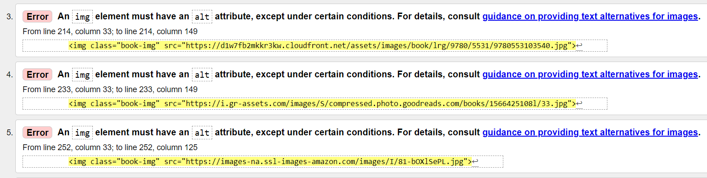
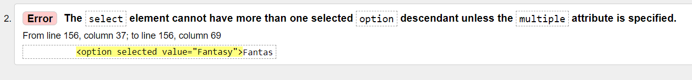
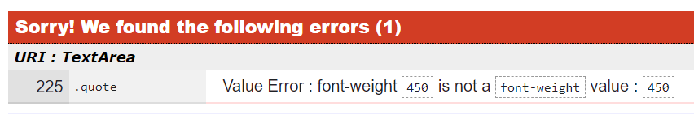
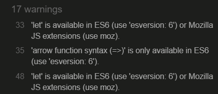
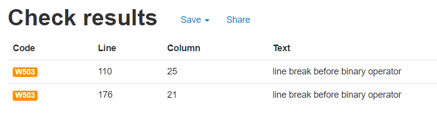
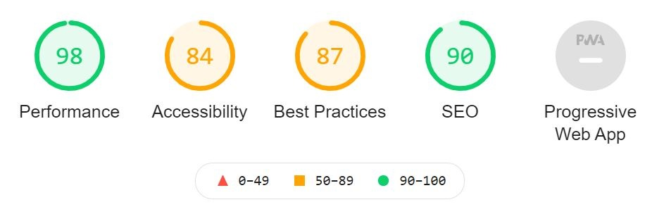
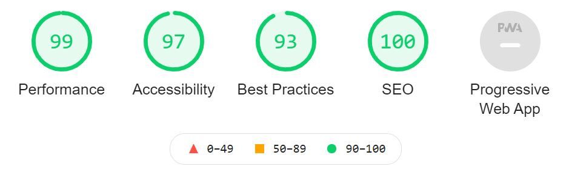
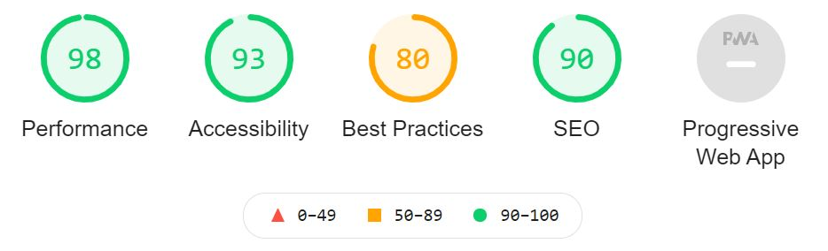
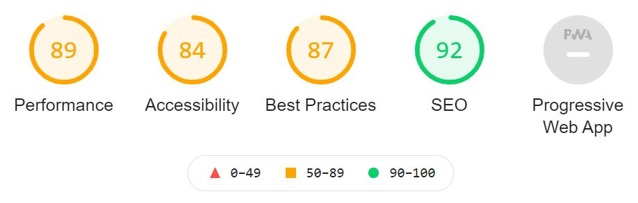
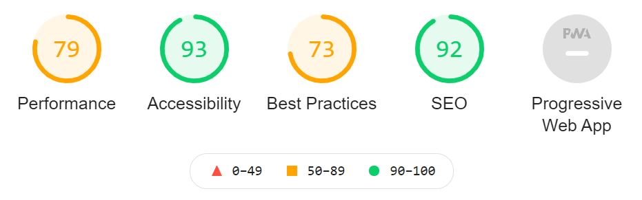

## Testing

Back to [Readme file.](README.md)

## Table of Contents
- [Functionality Testing](#functionality-testing)
- [Browser Compatability](#browser-compatability)
- [Code Validation](#code-validation)
- [Performance Testing](#performance-testing)
- [User Stories Testing](#user-stories-testing)
- [Bugs](#bugs)

---
### Code Validation

#### 1. Testing HTML with [The W3C Markup Validation Service](https://validator.w3.org/)

- Home page:
    - No errors. Two minor warnings about sections lacking a heading. These are warning are not an issue and can be safely ignored.

- Add Book page:
    - No errors. 1 similar warning to above.

- Book page:
    - No errors. 2 warnings similar to above.

- Books page:
    - 
    - 8 errors were discovered as I forgot to add the "alt" attribute to the img element.

- Edit Book page:
    - 

    - The error above was given when this page was put through the validator.
    - Solution was to remove the following line of unneccesary code from the page:
        - `<option value="" disabled selected>Choose your genre</option>`

- Contact/Login/Register page:
    - No errors on the three pages. 1 Section lacking a heading warning for each.

#### 2. Testing CSS with the [Jigsaw CSS Validation Service ](https://jigsaw.w3.org/css-validator/)
- There was 1 error relating to the value for the font-weight:

- Warnings were also discovered, but these relate mainly to "unknown vendor extensions", which can be safely ignored.

#### 3. Testing JavaScript with [JSHint](https://jshint.com/)

- When I Initially put my app.js code into JSHint, I was given 17 warnings:

- As can be seen from the image above, most of the warnings related to ES6's `let` keywords.
    - This is a minor warning. The solution to get rid of the warning was to add the following comment to the top of the app.js file:
        - /*jshint esversion: 6 */
    - This had the affect of reducing the warnings from 17 to 1.

- The remaining warning was about a missing semi-colon, which was easily fixed.

- JSHint also had an issue with undefined variable '$', used for jQuery. The solution was to put the following at the top of the app.js file:
    - /*globals $:false */

#### 4. Testing Python with [PEP8 online](http://pep8online.com/)

- When I initially put my app.py code into the PEP8 validator, I was given 2 minor issues:

- This was in relation to the following code:

    - "$skip": (
            pagination_data["BOOKS_PER_PAGE"]
            * (pagination_data["offset"] + int(page))
        )

- Solution was simply to move the multiply operator '*' back to the first line:

    - "$skip": (
            pagination_data["BOOKS_PER_PAGE"] *
            (pagination_data["offset"] + int(page))
        )

---
### Performance Testing

Testing page with Lighthouse in Chrome Dev Tools to optimise performance, accessibility, best practices and SEO

#### Desktop Performance

- **Lighthouse Desktop Home page report**:
    - As can be seen from the image below, performance was excellent.
    - Accessibiltiy was improved from it's original score of 84 by the following actions: 
        - Adding an aria-label to the button element which contained the search icon. It needed a name.
        - Adding aria-labels to the social media links.
    - Best Practices was improved from it's original score of 87 by:
        - Adding the 'rel="noopener"' to the external links i.e. Buy & Social media buttons.
    - SEO was improved by:
        - Adding a `<meta name="description">` element, which describes what the website is all about.

- **Lighthouse Desktop Home page report Improvements**:

    - As can be seen from the image below, the solutions above led to major improvements for the Home page and indeed for every page on the website.

- **Lighthouse Desktop report for the Books, Book, Contact, Login, Register pages** had roughly the same scores as for the Home page and therefore solutions were the same.
    - Performance was slightly worse on Books because of more Book images being shown.

- **Lighthouse Desktop Profile page report**:
    - As can be seen from image below, Best Practices was 80. This was because when a user logs in to the app, it can sometimes disable the HTTPS.

#### Mobile Performance

- **Lighthouse Mobile Home page report**:

    - Performance and Best practices was improved on mobile by re-sizing the images for George RR Martin and Mark Twain i.e making them smaller.
    - Unfortunately nothing could be done about the book images as they are taken from other sources on the internet and therefore I could not make them smaller myself before they are resized and loaded on the website.

- **Lighthouse Mobile report for the Books, Book, Contact, Login, Register** pages had roughly the same scores as for the Home page and therefore solutions were the same.
    - Performance was slightly worse on Books because of more Book images being shown.

- **Lighthouse Mobile Profile page report**:
    - Images affected performance worse on mobile.

---
## Bugs

**Bug:** There was an issue whereby books were not displaying in the correct order on the Books page. For example, if there were five books displayed from left to right (with 4 books per line), then the 5th book would not appear in the left-most position of it's line.

**Fix:** The reason for this was because of the different heights of the Book divs. The solution was to use JavaScript to make each book div equal to the height of the longest div.

Aside from the above, there were no more real bugs. Mainly there was just a lot of refactoring.